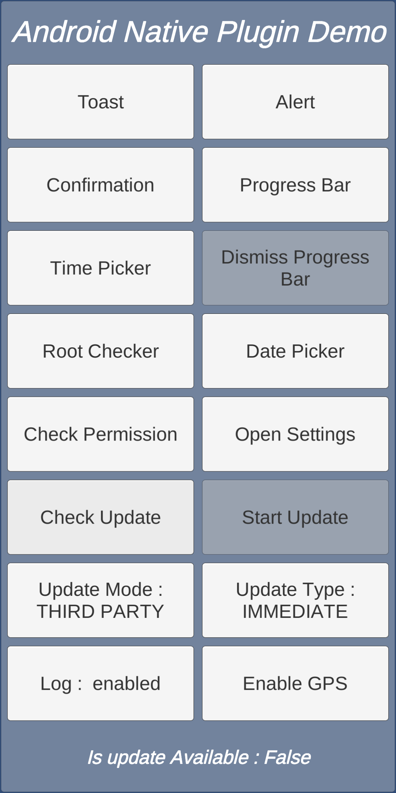

# Unity Mobile Native Plugin
 Native functions for Unity3D
<br><br><br>

## INSTALLATION
There are 2 ways to install this plugin:

1. import MobileNativePlugin.unitypackage via Assets-Import Package
2. clone/download this repository and move the Plugins folder to your Unity project's Assets folder
   
<br><br>

## Android Native Functions

### Requirements
* You project should build against Android 5.0 (API level 21) SDK at least.
* Runtime Permission works only with devices running Android 6.0 (API level 23) or higher.
* In-app updates works only with devices running Android 5.0 (API level 21) or higher.
* This plugin uses a custom tool for dependency management called the [Play Services Resolver](https://github.com/googlesamples/unity-jar-resolver)

Before we start, there is one mandatory step: add the following line inside the  `<application>...</application>` tag of Plugins/Android/AndroidManifest.xml:
```XML
<meta-data android:name="com.google.android.gms.version" android:value="@integer/google_play_services_version" />
```

**NOTE:** <br>
According to the Unity3D docs [here](https://docs.unity3d.com/Manual/PluginsForAndroid.html?_ga=2.55742827.1931527617.1606199410-1875972592.1543254704):
AndroidManifest.xml file placed in the `Assets->Plugins->Android` folder (placing a custom manifest completely overrides the default Unity Android manifest). 

Or select an existing manifest from `Project Settings->Publishing Settings->Build->Custom Main Manifest`
<br><br><br>
If your project doesn't have an AndroidManifest, you can copy Unity's default one from `C:\Program Files\Unity\Editor\Data\PlaybackEngines\AndroidPlayer\Apk`. 

Or select from plugins `\Assets\MobileNativePlugin\Plugins\Android`
<br><br><br>

### Dialogs

-	Show alert dialog with positive button
	```C#
	MobileNativeManager.ShowAlertMessage(string title, string message, string positiveButtonName)
	``` 
	- Returns the Click Action true if positive button clicked  
		```C#
		//Register for action
		MobileNativeManager.OnClickAction += OnClickAction;

		private void OnClickAction(bool action)
		{
			Debug.Log("OnClickAction clicked:: " + action);
		}
		```
	
-	Show alert dialog with both positive and negative button
	```C#
	MobileNativeManager.ShowConfirmationMessage(string title, string message, string positiveButtonName, string negativeButtonName)
	``` 
	-	Returns the Click Action true if positive button clicked or false if negative button cllicked
  
		```C#
		//Register for action
		MobileNativeManager.OnClickAction += OnClickAction;
		private void OnClickAction(bool action)
		{
			Debug.Log("OnClickAction clicked:: " + action);
		}
		``` 
	
-	Show the intermediate progress bar
	```C#
	MobileNativeManager.ShowProgressBar(string title, string message, bool cancelable)
	``` 
	-	Dismiss the progress bar
		```C#
		MobileNativeManager.DismissProgressBar()
		``` 
-	Show the time picker dialog or with requested hour, mins and format
	```C#
	MobileNativeManager.ShowTimePicker() or
	MobileNativeManager.ShowTimePicker(int hour, int minutes, bool is24HourFormat)
	``` 
	-	Returns the selected time
		```C#
		//Register for action
		MobileNativeManager.OnSelectedAction += OnSelectedAction;
		private void OnSelectedAction(string value)
		{
			Debug.Log("OnSelectedAction selected:: " + value);
		}
		``` 
-	Show the date picker dialog or with requested date
	```C#
	MobileNativeManager.ShowDatePicker() or
	MobileNativeManager.ShowDatePicker(int year, int month, int day)
	``` 
	- Returns the selected date
		```C#
		//Register for action
		MobileNativeManager.OnSelectedAction += OnSelectedAction;
		private void OnSelectedAction(string value)
		{
			Debug.Log("OnSelectedAction selected:: " + value);
		}
		``` 

	<table>
		<tr>
			<td>Dialog</td>
			<td>Time Picker</td>
		</tr>
		<tr>
			<td></td>
			<td></td>
		</tr>
	</table>

### Toast
-	Show the toast.
	```C#
	//Toast Duration: For Short 0,For Long 1.
	MobileNativeManager.ShowToast(string message, int Length)
	``` 

	<table>
		<tr>
			<td>Toast</td>
		</tr>
		<tr>
			<td></td>
		</tr>
	</table>

### Location
-	Add uses-permission to AndroidManifest
	```C#
	<uses-permission android:name="android.permission.ACCESS_FINE_LOCATION" /> 
	```
-	Enable location automatically
	```C#
 	MobileNativeManager.Instance.EnableLocation();
	```
	<table>
		<tr>
			<td>Enable Location</td>
		</tr>
		<tr>
			<td></td>
		</tr>
	</table>


### Options
-	Check whether device is rooted or not
	```C#
	(bool) MobileNativeManager.IsDeviceRooted()
	``` 
-	Opens app settings page
	```C#
	MobileNativeManager.OpenSettingScreen()
	```
<br><br>

### Runtime Permissions
Check the status of a permission, request a set of permissions and get a callback with the result.

*Optional step:* By default, Unity shows a permission dialog on startup to prevent plugins from crashing/malfunctioning. This can be disabled, if you want, but you must make sure to handle all the runtime permissions carefully in your app's lifecycle. 

To disable this dialog, add the following line inside the  `<application>...</application>` tag of Plugins/Android/AndroidManifest.xml:
```XML
<meta-data android:name="unityplayer.SkipPermissionsDialog" android:value="true" />
```

### API

-	Add uses-permission to AndroidManifest
	```C#
	<uses-permission android:name="android.permission.WRITE_EXTERNAL_STORAGE" /> 
	```

-	Check whether permission is granted or not

	```C#
	(bool) MobileNativeManager.CheckPermission(string permission)
	```

-	Check whether permission permission can show rationale dialog

	```C#
	(bool) MobileNativeManager.CheckPermissionRationale(string permission)
	```

-	Request Permission
	-	Single permission

		```C#
		MobileNativeManager.RequestPermission(string permission)
		```
	-	Multiple permission

		```C#
		MobileNativeManager.RequestPermission(params string[] permission)
		```

  	- Callback
		```C#
		//Register for action
        MobileNativeManager.OnPermissionGranted += OnPermissionGranted;
        MobileNativeManager.OnPermissionDenied += OnPermissionDenied;
        MobileNativeManager.OnPermissionError += OnPermissionError;

		// Invoked when atleast one permission got granted
		// grantedPermissions containes list of all permission where granted by user.
		// all will be true if no of requested and granted permission are equal
		private void OnPermissionGranted(string[] grantedPermissions, bool all) {}

		// Invoked when any permission got denied
		// deniedPermissions containes list of all permission where granted by user.
		private void OnPermissionDenied(string[] deniedPermissions) {}

		// Invoked when any occurs during request
		// Returns any error occured during the runtime requesting.
		private void OnPermissionError(string error) {}
		```

	<table>
		<tr>
			<td>Permission Dialog</td>
			<td>Request Permission</td>
		</tr>
		<tr>
			<td></td>
			<td></td>
		</tr>
	</table>
<br><br>

### Sharing Content

Share text content
```C#	
	MobileNativeManager.Instance.ShareTextContent(string message, string header = "");
```

Share text with one file content
```C#	
	//filePath can be any image file path in android or can also be file URI 
	MobileNativeManager.Instance.ShareFileContent(string message, string filePath = "", bool isFileUri = false, string header = "");
```

Share multiple files
```C#	
	//fileData which accepts array of file paths and file URI
	MobileNativeManager.Instance.ShareMultipleFileContent(string message, MultipleFilesData fileData, string header = "");
```

Share content on Emails
```C#	
	//emailData which accepts array of emailTo, emailCc, emailBcc along with MultipleFilesData 
	MobileNativeManager.Instance.ShareOnMail(EmailSharingData emailData, string header = "");
```

Share content on WhatsApp
```C#	
	//WhatsApp share is similar to single file content share except its open WhatsApp directly and can also open specific WhatsApp provided
	MobileNativeManager.Instance.ShareOnWhatsApp(string message, string mobileNo = "", string filePath = "", bool isFileUri = false, string header = "")
```

<table>
	<tr>
		<td>Share</td>
	</tr>
	<tr>
		<td></td>
	</tr>
</table>
<br><br>

### Image Picker Camera / Gallery

To get image from device via Camera or Gallery

```C#	
  	//Call all default values
	//pickerType = ImagePickerType.CHOICE
	//maxWidth = 612
	//maxHeight = 816
	//quality = 80
	MobileNativeManager.Instance.GetImageFromDevice();
```
or 
```C#	
  	//Calling required types
	//CHOICE = 0, CAMERA = 1, GALLERY = 2
	MobileNativeManager.Instance.GetImageFromDevice(ImagePickerType pickerType = ImagePickerType.CHOICE, int maxWidth = 612, int maxHeight = 816, int quality = 80);
```
-	Callbacks
```C#
	//Register for action	
	MobileNativeManager.OnImagePicked += OnImagePicked;
	MobileNativeManager.OnImagePickedError += OnImagePickedError;
```

<table>
	<tr>
		<td>Image picker choice</td>
		<td>Selected image from gallery</td>
	</tr>
	<tr>
		<td></td>
		<td></td>
	</tr>
</table>
<br><br>

### In App Update

Now android application can be updated wihtout leaving the app, its works on both scenarios:

1. Play Store Update
2. Using External Link (Some app will not be available on playstore but still can be updated)
<br><br>

### Play Store In-App Update
There are two update modes.

Flexible (default) - Shows the user an upgrade dialog but performs the downloading of the update within the background. This means that the user can continue using our app whilst the update is being downloaded. When the update is downloaded asks the user confirmation to perform the install.

Immediate - Will trigger a blocking UI until download and installation is finished. Restart is triggered automatically
<br><br>

### External Link In-App Update
Downloads an apk from server and tries install it automatically, but requires storage and install packages permissions.
<br><br>
### API 
-	Add uses-permission to AndroidManifest
	```XML
	<!-- Required for internet access -->
	<uses-permission android:name="android.permission.INTERNET" />
	<uses-permission android:name="android.permission.ACCESS_NETWORK_STATE" />
	<uses-permission android:name="android.permission.ACCESS_WIFI_STATE" />

	<!-- Required for third party apk install -->
  	<uses-permission android:name="android.permission.WRITE_EXTERNAL_STORAGE" />
	<uses-permission android:name="android.permission.DOWNLOAD_WITHOUT_NOTIFICATION" />
  	<uses-permission android:name="android.permission.REQUEST_INSTALL_PACKAGES" />
	```
-	Check for update
	```C#
	//UpdateMode can either play store or third party
	//PLAY_STORE = 0, THIRD_PARTY = 1
	//UpdateType can either FLEXIBLE or Immediate and no use for Third party update
	//FLEXIBLE = 0, IMMEDIATE = 1
	//thirdPartyLink, an external link which can download apk on the fly
	MobileNativeManager.CheckForUpdate(UpdateMode updateMode, UpdateType updateType, string thirdPartyLink  = "")
	```
-	To start the instalation of the update
	```C#
	//Sholud call only if isUpdateAvailable is true 
	MobileNativeManager.StartUpdate()
	```
-	To complete the instalation of the update
	```C#
	//Sholud call only if isUpdateAvailable is true 
	//This has no impact while using third party link update
	MobileNativeManager.CompleteUpdate()
	```
-	To continue update 
	```C#
	//must can called only on app resume to complete the pending update of previous update
	//This has no impact while using third party link update
	MobileNativeManager.ContinueUpdate()
	```
-	Callbacks
	```C#
	//Register for action
	MobileNativeManager.OnUpdateAvailable += OnUpdateAvailable;
	MobileNativeManager.OnUpdateVersionCode += OnUpdateVersionCode;
	MobileNativeManager.OnUpdateStalenessDays += OnUpdateStalenessDays;
	MobileNativeManager.OnUpdateInstallState += OnUpdateInstallState;
	MobileNativeManager.OnUpdateDownloading += OnUpdateDownloading;
	MobileNativeManager.OnUpdateError += OnUpdateError;

	//Invoked when Google Play Services returns a response 
	private void OnUpdateAvailable(bool isUpdateAvailable) {}

	// Invoked when the update is available with version code
	private void OnUpdateVersionCode(int versionCode) {}

	// Invoked when the update is available with staleness days
	private void OnUpdateStalenessDays(int days) {}

	// Invoked when install status of the update
	private void OnUpdateInstallState(int state) {}

	// Invoked during downloading
	private void onUpdateDownloading(long bytesDownloaded, long bytesTotal) {}

	// Invoked when the update encounter error
	private void onUpdateError(int code, string error) {}
	
	//Error code returns during the update process	
	//Playstore update error code 
	ERROR_DOWNLOAD_NOT_PRESENT = -7,
	ERROR_API_NOT_AVAILABLE = -3,
	ERROR_INSTALL_IN_PROGRESS = -8,
	ERROR_INSTALL_NOT_ALLOWED = -6,
	ERROR_INSTALL_UNAVAILABLE = -5,
	ERROR_INTERNAL_ERROR = -100,
	ERROR_INVALID_REQUEST = -4,
	ERROR_PLAY_STORE_NOT_FOUND = -9,
	ERROR_UNKNOWN = -2,
	NO_ERROR = 0,
	ERROR_LIBRARY = -1,
	//External apk udpate error code 
	ERROR_STORAGE_PERMISSION = -101,
	ERROR_NETWORK = -102
	```

	<table>
		<tr>
			<td>Check Update</td>
		</tr>
		<tr>
			<td></td>
		</tr>
	</table>

**Note:** 
1. You can decide which update should be forced by using either Firebase Remote Config or a Configuration file hosted on your server
2. When using external links, OnUpdateAvailable returns true when storage and network available, so you must update apk from link only when version validation is done by using either Firebase Remote Config or a Configuration file hosted on your server
3. Its mandatory to be called `MobileNativeManager.Instance.CompleteUpdate()` when download is completed
<br><br>

### Troubleshoot
1. In-app updates works only with devices running Android 5.0 (API level 21) or higher.
2. Testing this won’t work on a debug build. You would need a release build signed with the same key you use to sign your app before uploading to the Play Store. It would be a good time to use the internal testing track.
3. In-app updates are available only to user accounts that own the app. So, make sure the account you’re using has downloaded your app from Google Play at least once before using the account to test in-app updates.
4. Because Google Play can only update an app to a higher version code, make sure the app you are testing as a lower version code than the update version code.
5. Make sure the account is eligible and the Google Play cache is up to date. To do so, while logged into the Google Play Store account on the test device, proceed as follows:
   1. Make sure you completely [close the Google Play Store App](https://support.google.com/android/answer/9079646#close_apps).
   2. Open the Google Play Store app and go to the My Apps & Games tab.
   3. If the app you are testing doesn’t appear with an available update, check that you’ve properly [set up your testing tracks](https://support.google.com/googleplay/android-developer/answer/3131213?hl=en)

### Debug
-	Toggle library logs
	```C#
	//By default puglin console log will be diabled, but can be enabled
	MobileNativeManager.Instance.PluginDebug(bool showLog);
	```
<br><br>

## :open_hands: Contributions
Any contributions are welcome!

1. Fork it
2. Create your feature branch (git checkout -b my-new-feature)
3. Commit your changes (git commit -am 'Add some feature')
4. Push to the branch (git push origin my-new-feature)
5. Create New Pull Request

<br><br>

## :page_facing_up: License
```
MIT License

Copyright (c) 2020 Durga Chiranjeevi

Permission is hereby granted, free of charge, to any person obtaining a copy
of this software and associated documentation files (the "Software"), to deal
in the Software without restriction, including without limitation the rights
to use, copy, modify, merge, publish, distribute, sublicense, and/or sell
copies of the Software, and to permit persons to whom the Software is
furnished to do so, subject to the following conditions:

The above copyright notice and this permission notice shall be included in all
copies or substantial portions of the Software.

THE SOFTWARE IS PROVIDED "AS IS", WITHOUT WARRANTY OF ANY KIND, EXPRESS OR
IMPLIED, INCLUDING BUT NOT LIMITED TO THE WARRANTIES OF MERCHANTABILITY,
FITNESS FOR A PARTICULAR PURPOSE AND NONINFRINGEMENT. IN NO EVENT SHALL THE
AUTHORS OR COPYRIGHT HOLDERS BE LIABLE FOR ANY CLAIM, DAMAGES OR OTHER
LIABILITY, WHETHER IN AN ACTION OF CONTRACT, TORT OR OTHERWISE, ARISING FROM,
OUT OF OR IN CONNECTION WITH THE SOFTWARE OR THE USE OR OTHER DEALINGS IN THE
SOFTWARE